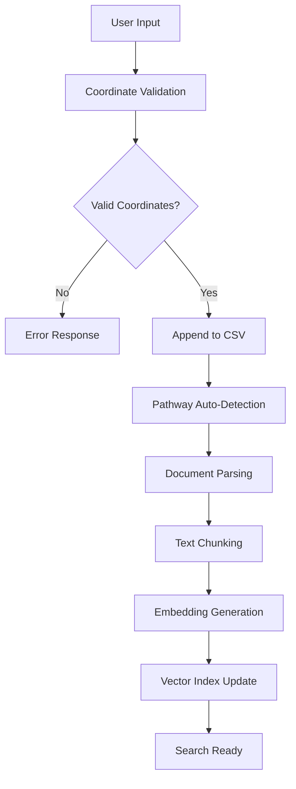
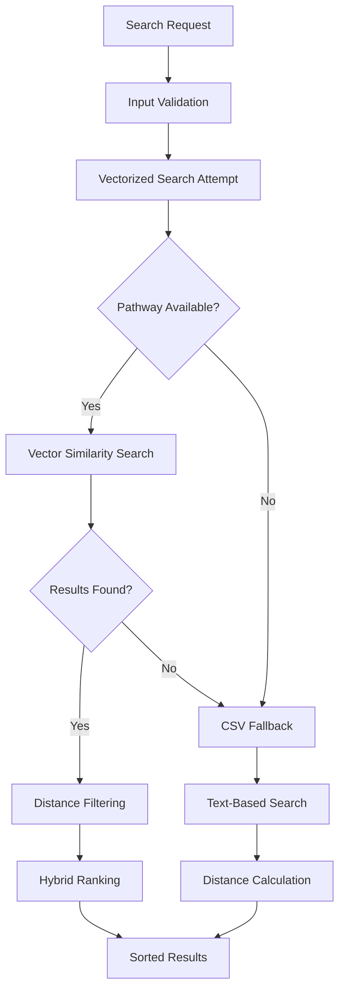

# 🏢 Business Location RAG System - Complete Technical Reference

A comprehensive location-based business search system powered by Pathway RAG, FastAPI, and Streamlit with AI-powered vectorized search and intelligent fallback mechanisms.

## 📋 Table of Contents

- [🏗️ System Architecture](#-system-architecture)
- [🔄 Data Flow Overview](#-data-flow-overview)
- [🧩 System Components](#-system-components)
- [📡 API Endpoints Reference](#-api-endpoints-reference)
- [🔍 Query Examples](#-query-examples)
- [📊 Data Flows](#-data-flows)
- [⚙️ Configuration](#-configuration)
- [🐛 Troubleshooting](#-troubleshooting)
- [🚀 Deployment](#-deployment)

---

## 🏗️ System Architecture

```
┌─────────────────┐    ┌─────────────────┐    ┌─────────────────┐
│   Streamlit UI  │    │   Upload API    │    │  Pathway RAG    │
│   (Port 8501)   │◄──►│   (Port 8001)   │◄──►│   (Port 8000)   │
└─────────────────┘    └─────────────────┘    └─────────────────┘
         │                       │                       │
         │                       │                       │
         ▼                       ▼                       ▼
┌─────────────────┐    ┌─────────────────┐    ┌─────────────────┐
│ Business Forms  │    │  CSV Management │    │ Vector Database │
│ Location Search │    │ Distance Calc   │    │ LLM Integration │
│ RAG Chat        │    │ Smart Filtering │    │ Auto Indexing   │
└─────────────────┘    └─────────────────┘    └─────────────────┘
```

### Core Technologies
- **Pathway RAG**: Real-time document indexing and vectorized search
- **FastAPI**: Business data management and search APIs
- **Streamlit**: Multi-page web interface
- **OpenAI**: GPT-4o for LLM and text-embedding-ada-002 for embeddings
- **CSV Storage**: Business data persistence with automatic fallback

---

## 🔄 Data Flow Overview

### 1. Business Registration Flow
```
User Input → Validation → CSV Storage → Pathway Auto-Indexing → Vector Embeddings → Search Ready
```

### 2. Search Flow
```
User Query → Location Input → API Request → Vectorized Search → Distance Filtering → Sorted Results
                                     ↓ (if fails)
                                 CSV Fallback → Distance Calculation → Sorted Results
```

### 3. Indexing Flow
```
CSV Update → Pathway File Monitor → DoclingParser → TokenCountSplitter → OpenAI Embedder → USearch Vector Index
```

---

## 🧩 System Components

### **1. Pathway RAG Server (Port 8000)**
- **Purpose**: AI-powered document indexing and question answering
- **Key Features**:
  - Real-time file monitoring and auto-indexing
  - Vector embeddings using OpenAI
  - Semantic search capabilities
  - Document-based Q&A

### **2. Upload API Server (Port 8001)**
- **Purpose**: Business data management and location search
- **Key Features**:
  - Business registration and validation
  - Location-based search with distance calculations
  - Intelligent search method selection (vectorized → CSV fallback)
  - Health monitoring and system status

### **3. Streamlit UI (Port 8501)**
- **Purpose**: User interface for all system interactions
- **Pages**:
  - **Main Dashboard**: System overview and navigation
  - **Business Registration**: Add businesses to the database
  - **Location Search**: Find businesses by location and query
  - **RAG Chat**: Document Q&A interface

---

## 📡 API Endpoints Reference

### 🔵 Pathway RAG API (Port 8000)

#### **Document Indexing Endpoints**

##### **GET /v1/statistics**
Get indexing statistics and system health.

**Request:**
```bash
curl -X POST http://localhost:8000/v1/statistics \
  -H "Content-Type: application/json"
```

**Response:**
```json
{
  "file_count": 51,
  "last_modified": 1758114045,
  "last_indexed": 1758143150
}
```

##### **POST /v2/list_documents**
Retrieve metadata of all indexed documents.

**Request:**
```bash
curl -X POST http://localhost:8000/v2/list_documents \
  -H "Content-Type: application/json" \
  -d '{}'
```

**Response:**
```json
[
  {
    "created_at": 1758142497,
    "modified_at": 1758144113,
    "owner": "root",
    "path": "data/data.csv",
    "size": 577,
    "seen_at": 1758144213
  }
]
```

##### **POST /v1/retrieve**
Perform vector similarity search on indexed documents.

**Request:**
```bash
curl -X POST http://localhost:8000/v1/retrieve \
  -H "Content-Type: application/json" \
  -d '{
    "query": "coffee shops with wifi",
    "k": 10,
    "metadata_filter": "contains(path, `csv`)",
    "filepath_globpattern": "*.csv"
  }'
```

**Response:**
```json
[
  {
    "text": "John Smith,Smith Coffee House,37.7749,-122.4194,Cafe,coffee,wifi,outdoor-seating",
    "metadata": {
      "path": "data/data.csv",
      "source": "filesystem"
    },
    "dist": 0.15
  }
]
```

#### **LLM and RAG Endpoints**

##### **POST /v2/answer**
Ask questions about indexed documents using RAG.

**Request:**
```bash
curl -X POST http://localhost:8000/v2/answer \
  -H "Content-Type: application/json" \
  -d '{
    "prompt": "What cafes are available in San Francisco?",
    "return_context_docs": true,
    "model": "gpt-4o",
    "response_type": "long"
  }'
```

**Response:**
```json
{
  "response": "Based on the available data, there is Smith Coffee House located in San Francisco...",
  "context_docs": [
    {
      "text": "John Smith,Smith Coffee House,37.7749,-122.4194,Cafe,coffee,wifi,outdoor-seating",
      "metadata": {
        "path": "data/data.csv"
      }
    }
  ]
}
```

##### **POST /v2/summarize**
Summarize a list of texts.

**Request:**
```bash
curl -X POST http://localhost:8000/v2/summarize \
  -H "Content-Type: application/json" \
  -d '{
    "text_list": [
      "Smith Coffee House offers coffee and wifi",
      "Dev Ally provides coffee, espresso, tea and workspace"
    ],
    "model": "gpt-4o"
  }'
```

**Response:**
```json
{
  "summary": "Both businesses offer coffee services, with Smith Coffee House focusing on coffee and wifi, while Dev Ally provides a broader range including espresso, tea, and workspace facilities."
}
```

### 🟢 Upload API (Port 8001)

#### **Business Management Endpoints**

##### **POST /append-csv**
Add a single business record to the database.

**Request:**
```bash
curl -X POST http://localhost:8001/append-csv \
  -H "Content-Type: application/json" \
  -d '{
    "name": "Alice Johnson",
    "business_name": "Alice Pizza Palace",
    "lat_long": "40.7128,-74.0060",
    "business_category": "Restaurant",
    "business_tags": "pizza,italian,delivery,dine-in"
  }'
```

**Response:**
```json
{
  "ok": true,
  "appended": 1,
  "csv_path": "/root/ai-rag/mk1/ai-assistant-rag/data/data.csv",
  "coordinates": {
    "latitude": 40.7128,
    "longitude": -74.0060
  }
}
```

**Error Response:**
```json
{
  "ok": false,
  "error": "Invalid lat_long format. Use 'latitude,longitude'"
}
```

##### **POST /append-csv/batch**
Add multiple business records in one request.

**Request:**
```bash
curl -X POST http://localhost:8001/append-csv/batch \
  -H "Content-Type: application/json" \
  -d '{
    "records": [
      {
        "name": "Bob Wilson",
        "business_name": "Bob Auto Repair",
        "lat_long": "34.0522,-118.2437",
        "business_category": "Auto Service",
        "business_tags": "repair,maintenance,towing"
      },
      {
        "name": "Carol Davis",
        "business_name": "Davis Medical Clinic",
        "lat_long": "41.8781,-87.6298",
        "business_category": "Healthcare",
        "business_tags": "clinic,doctor,medical"
      }
    ]
  }'
```

**Response:**
```json
{
  "ok": true,
  "appended": 2,
  "csv_path": "/root/ai-rag/mk1/ai-assistant-rag/data/data.csv"
}
```

#### **Search Endpoints**

##### **POST /search-businesses**
Primary search endpoint with vectorized AI search and automatic CSV fallback.

**Request:**
```bash
curl -X POST http://localhost:8001/search-businesses \
  -H "Content-Type: application/json" \
  -d '{
    "user_lat": 37.7749,
    "user_lng": -122.4194,
    "query": "coffee shops with wifi",
    "max_distance_km": 20000.0,
    "category_filter": "Cafe",
    "tag_filters": ["wifi", "coffee"],
    "limit": 10
  }'
```

**Successful Response (Vectorized):**
```json
{
  "ok": true,
  "results": [
    {
      "name": "John Smith",
      "business_name": "Smith Coffee House",
      "latitude": 37.7749,
      "longitude": -122.4194,
      "lat_long": "37.7749,-122.4194",
      "business_category": "Cafe",
      "business_tags": "coffee,wifi,outdoor-seating",
      "distance_km": 0.0,
      "vector_score": 0.12,
      "source_path": "data/data.csv"
    }
  ],
  "search_params": {
    "user_location": {"lat": 37.7749, "lng": -122.4194},
    "max_distance_km": 20000.0,
    "category_filter": "Cafe",
    "tag_filters": ["wifi", "coffee"],
    "query": "coffee shops with wifi"
  },
  "total_found": 1,
  "search_method": "vectorized"
}
```

**Fallback Response (CSV):**
```json
{
  "ok": true,
  "results": [
    {
      "name": "John Smith",
      "business_name": "Smith Coffee House",
      "latitude": 37.7749,
      "longitude": -122.4194,
      "lat_long": "37.7749,-122.4194",
      "business_category": "Cafe",
      "business_tags": "coffee,wifi,outdoor-seating",
      "distance_km": 0.0
    }
  ],
  "search_params": {
    "user_location": {"lat": 37.7749, "lng": -122.4194},
    "max_distance_km": 20000.0,
    "query": "coffee shops with wifi"
  },
  "total_found": 1,
  "search_method": "csv_empty_retrieve"
}
```

##### **POST /search-businesses-csv**
CSV-only search endpoint (fallback method).

**Request:**
```bash
curl -X POST http://localhost:8001/search-businesses-csv \
  -H "Content-Type: application/json" \
  -d '{
    "user_lat": 37.7749,
    "user_lng": -122.4194,
    "query": "restaurants",
    "max_distance_km": 10.0,
    "limit": 5
  }'
```

**Response:**
```json
{
  "ok": true,
  "results": [
    {
      "name": "Maria Garcia",
      "business_name": "Garcia Italian Restaurant",
      "latitude": 40.7128,
      "longitude": -74.006,
      "business_category": "Restaurant",
      "business_tags": "italian,pasta,pizza",
      "distance_km": 4129.09
    }
  ],
  "search_params": {
    "user_location": {"lat": 37.7749, "lng": -122.4194},
    "max_distance_km": 10.0,
    "query": "restaurants"
  },
  "total_found": 1,
  "search_method": "csv_only"
}
```

#### **System Health Endpoint**

##### **GET /health**
Get system health status including Pathway connectivity.

**Request:**
```bash
curl -X GET http://localhost:8001/health
```

**Response:**
```json
{
  "status": "healthy",
  "csv_exists": true,
  "csv_path": "/root/ai-rag/mk1/ai-assistant-rag/data/data.csv",
  "data_dir": "/root/ai-rag/mk1/ai-assistant-rag/data",
  "pathway_status": "online",
  "pathway_url": "http://localhost:8000"
}
```

**Possible pathway_status values:**
- `"online"`: Pathway is accessible and responding
- `"offline"`: Cannot connect to Pathway
- `"timeout"`: Pathway request timed out
- `"error"`: Pathway returned an error

---

## 🔍 Query Examples

### **Basic Business Search Queries**

#### Coffee Shops
```bash
# Find all coffee shops globally
curl -X POST http://localhost:8001/search-businesses \
  -H "Content-Type: application/json" \
  -d '{
    "user_lat": 37.7749,
    "user_lng": -122.4194,
    "query": "coffee",
    "max_distance_km": 20000.0
  }'

# Find coffee shops with wifi within 5km
curl -X POST http://localhost:8001/search-businesses \
  -H "Content-Type: application/json" \
  -d '{
    "user_lat": 37.7749,
    "user_lng": -122.4194,
    "query": "coffee wifi",
    "max_distance_km": 5.0,
    "tag_filters": ["wifi"]
  }'
```

#### Restaurants
```bash
# Find Italian restaurants
curl -X POST http://localhost:8001/search-businesses \
  -H "Content-Type: application/json" \
  -d '{
    "user_lat": 40.7128,
    "user_lng": -74.0060,
    "query": "italian food",
    "category_filter": "Restaurant",
    "max_distance_km": 20000.0
  }'

# Find pizza places with delivery
curl -X POST http://localhost:8001/search-businesses \
  -H "Content-Type: application/json" \
  -d '{
    "user_lat": 40.7128,
    "user_lng": -74.0060,
    "query": "pizza delivery",
    "tag_filters": ["pizza", "delivery"],
    "max_distance_km": 15.0
  }'
```

#### Healthcare
```bash
# Find medical clinics
curl -X POST http://localhost:8001/search-businesses \
  -H "Content-Type: application/json" \
  -d '{
    "user_lat": 41.8781,
    "user_lng": -87.6298,
    "query": "doctor clinic",
    "category_filter": "Healthcare",
    "max_distance_km": 20000.0
  }'
```

### **Advanced RAG Queries**

#### Document-Based Questions
```bash
# Ask about available businesses
curl -X POST http://localhost:8000/v2/answer \
  -H "Content-Type: application/json" \
  -d '{
    "prompt": "What types of businesses are available in the database?",
    "return_context_docs": true
  }'

# Ask about specific locations
curl -X POST http://localhost:8000/v2/answer \
  -H "Content-Type: application/json" \
  -d '{
    "prompt": "What businesses are located in San Francisco?",
    "filters": "contains(path, `data.csv`)"
  }'

# Ask about business features
curl -X POST http://localhost:8000/v2/answer \
  -H "Content-Type: application/json" \
  -d '{
    "prompt": "Which cafes offer wifi and outdoor seating?",
    "return_context_docs": true,
    "response_type": "long"
  }'
```

#### Vector Similarity Search
```bash
# Semantic search for workspace-friendly places
curl -X POST http://localhost:8000/v1/retrieve \
  -H "Content-Type: application/json" \
  -d '{
    "query": "workspace coffee wifi remote work",
    "k": 5
  }'

# Search for food-related businesses
curl -X POST http://localhost:8000/v1/retrieve \
  -H "Content-Type: application/json" \
  -d '{
    "query": "restaurant food dining pizza italian",
    "k": 10
  }'
```

### **Complex Search Scenarios**

#### Multi-Filter Search
```bash
# Find cafes with specific amenities within walking distance
curl -X POST http://localhost:8001/search-businesses \
  -H "Content-Type: application/json" \
  -d '{
    "user_lat": 37.7749,
    "user_lng": -122.4194,
    "query": "cafe workspace",
    "category_filter": "Cafe",
    "tag_filters": ["wifi", "coffee"],
    "max_distance_km": 2.0,
    "limit": 5
  }'
```

#### Unlimited Distance Search
```bash
# Find all businesses of a type globally, sorted by distance
curl -X POST http://localhost:8001/search-businesses \
  -H "Content-Type: application/json" \
  -d '{
    "user_lat": 37.7749,
    "user_lng": -122.4194,
    "query": "electronics store",
    "max_distance_km": 20000.0,
    "limit": 100
  }'
```

---

## 📊 Data Flows

### **1. Business Registration Flow**



**Step-by-Step Process:**
1. **Input Validation**: Coordinates checked for valid lat/lng ranges
2. **CSV Storage**: Business data appended to `data/data.csv`
3. **Auto-Detection**: Pathway monitors file changes automatically
4. **Parsing**: DoclingParser processes the CSV file
5. **Chunking**: TokenCountSplitter breaks data into searchable chunks
6. **Embedding**: OpenAI generates vector embeddings
7. **Indexing**: USearch stores embeddings for fast retrieval

### **2. Search Flow**



**Search Method Priority:**
1. **Vectorized Search**: Primary method using AI embeddings
2. **CSV Fallback**: Backup method using text matching
3. **Error Handling**: Graceful degradation with informative messages

### **3. Ranking Algorithm**

#### **Vectorized Search Ranking**
```python
def calculate_score(business, max_distance_km):
    vector_score = business.vector_score  # Lower = more relevant
    distance_km = business.distance_km    # Lower = closer
    
    if max_distance_km >= 10000:  # Unlimited search
        # Priority: 40% relevance, 60% distance
        max_actual_distance = max(all_distances)
        normalized_distance = distance_km / max_actual_distance
        return 0.4 * vector_score + 0.6 * normalized_distance
    else:  # Limited search
        # Priority: 70% relevance, 30% distance
        normalized_distance = distance_km / max_distance_km
        return 0.7 * vector_score + 0.3 * normalized_distance
```

#### **CSV Search Ranking**
```python
def csv_ranking(businesses):
    # Simple distance-based sorting
    return sorted(businesses, key=lambda x: x.distance_km)
```

---

## ⚙️ Configuration

### **Environment Variables**
```bash
# OpenAI API Configuration
OPENAI_API_KEY=sk-your-openai-api-key-here

# Data Directory
DATA_DIR=data

# Service URLs
PATHWAY_HOST=localhost
PATHWAY_PORT=8000
UPLOAD_API_HOST=localhost
UPLOAD_API_PORT=8001
```

### **Pathway Configuration (app.yaml)**
```yaml
# Data Sources
$sources:
  - !pw.io.fs.read
    path: data
    format: binary
    with_metadata: true

# LLM Configuration
$llm: !pw.xpacks.llm.llms.OpenAIChat
  model: "gpt-4o"
  temperature: 0
  capacity: 8

# Embedder Configuration
$embedder: !pw.xpacks.llm.embedders.OpenAIEmbedder
  model: "text-embedding-ada-002"
  cache_strategy: !pw.udfs.DefaultCache {}

# Text Processing
$splitter: !pw.xpacks.llm.splitters.TokenCountSplitter
  max_tokens: 400

$parser: !pw.xpacks.llm.parsers.DoclingParser
  async_mode: "fully_async"

# Vector Index
$retriever_factory: !pw.stdlib.indexing.UsearchKnnFactory
  reserved_space: 1000
  embedder: $embedder
  metric: !pw.stdlib.indexing.USearchMetricKind.COS
```

### **API Request Limits**
```python
# Search Request Validation
class LocationSearchRequest(BaseModel):
    user_lat: float = Field(..., ge=-90, le=90)
    user_lng: float = Field(..., ge=-180, le=180)
    max_distance_km: float = Field(10.0, gt=0, le=25000)  # Up to 25,000km
    limit: int = Field(20, gt=0, le=200)  # Up to 200 results
```

---

## 🐛 Troubleshooting

### **Common Issues**

#### **1. 422 Validation Error**
**Problem**: `422 Unprocessable Content` on search requests

**Cause**: Invalid request parameters

**Solutions**:
```bash
# Check coordinate ranges
user_lat: -90 to 90
user_lng: -180 to 180

# Check distance limits
max_distance_km: 0 to 25,000

# Check result limits
limit: 1 to 200
```

#### **2. Empty Search Results**
**Problem**: No businesses found despite having data

**Diagnosis**:
```bash
# Check if CSV exists and has data
curl http://localhost:8001/health

# Test CSV-only search
curl -X POST http://localhost:8001/search-businesses-csv \
  -H "Content-Type: application/json" \
  -d '{"user_lat": 37.7749, "user_lng": -122.4194, "query": "business", "max_distance_km": 20000.0}'

# Check Pathway indexing status
curl -X POST http://localhost:8000/v2/list_documents
```

**Solutions**:
- Verify CSV file format and data quality
- Check if coordinates are valid
- Increase search radius
- Try different search terms

#### **3. Pathway Connection Issues**
**Problem**: System falls back to CSV search constantly

**Diagnosis**:
```bash
# Test Pathway directly
curl -X POST http://localhost:8000/v1/statistics

# Check health endpoint
curl http://localhost:8001/health
```

**Solutions**:
- Restart Pathway service
- Check OpenAI API key configuration
- Verify port availability (8000)
- Check firewall settings

#### **4. UI Loading Issues**
**Problem**: Streamlit pages not loading or showing errors

**Solutions**:
```bash
# Check if UI server is running
ps aux | grep streamlit

# Restart UI server
cd ui && streamlit run main.py --server.port 8501

# Check port availability
lsof -i :8501
```

### **Debug Commands**

#### **System Status Check**
```bash
# Check all services
curl http://localhost:8001/health
curl -X POST http://localhost:8000/v1/statistics
curl http://localhost:8501  # Should return HTML

# Check process status
ps aux | grep -E "(python|streamlit)"

# Check port usage
lsof -i :8000 :8001 :8501
```

#### **Data Verification**
```bash
# Check CSV content
cat data/data.csv

# Verify CSV format
head -n 5 data/data.csv

# Check file permissions
ls -la data/data.csv
```

#### **API Testing**
```bash
# Test business registration
curl -X POST http://localhost:8001/append-csv \
  -H "Content-Type: application/json" \
  -d '{"name": "Test User", "business_name": "Test Business", "lat_long": "0,0", "business_category": "Test", "business_tags": "test"}'

# Test search functionality
curl -X POST http://localhost:8001/search-businesses \
  -H "Content-Type: application/json" \
  -d '{"user_lat": 0, "user_lng": 0, "query": "test", "max_distance_km": 20000.0}'
```

---

## 🚀 Deployment

### **Local Development Setup**

#### **1. Prerequisites**
```bash
# Python 3.9+
python3 --version

# Virtual environment
python3 -m venv venv
source venv/bin/activate  # Linux/Mac
# or
venv\Scripts\activate  # Windows
```

#### **2. Installation**
```bash
# Install dependencies
pip install -r requirements.txt
cd ui && pip install -r requirements.txt && cd ..

# Set up environment
echo "OPENAI_API_KEY=your-key-here" > .env
```

#### **3. Running Services**

**Option A: Manual Start (Recommended for Development)**
```bash
# Terminal 1: Main application (Pathway + Upload API)
cd /root/ai-rag/mk1/ai-assistant-rag
source venv/bin/activate
python app.py

# Terminal 2: Streamlit UI
cd ui
source ../venv/bin/activate
streamlit run main.py --server.port 8501
```

**Option B: Docker**
```bash
docker compose build
docker compose up
```

### **Production Deployment**

#### **Docker Compose Configuration**
```yaml
version: '3.8'

services:
  pathway-rag:
    build: .
    ports:
      - "8000:8000"
      - "8001:8001"
    environment:
      - OPENAI_API_KEY=${OPENAI_API_KEY}
    volumes:
      - ./data:/app/data
      - ./Cache:/app/Cache

  streamlit-ui:
    build: 
      context: .
      dockerfile: ui/Dockerfile
    ports:
      - "8501:8501"
    depends_on:
      - pathway-rag
    environment:
      - PATHWAY_HOST=pathway-rag
```

#### **Environment Variables for Production**
```bash
# Security
OPENAI_API_KEY=sk-production-key
PATHWAY_PORT=8000
UPLOAD_API_PORT=8001

# Performance
PATHWAY_WORKERS=4
UVICORN_WORKERS=2

# Monitoring
LOG_LEVEL=INFO
SENTRY_DSN=your-sentry-dsn
```

### **Health Monitoring**

#### **Service Health Endpoints**
```bash
# Upload API Health
curl http://localhost:8001/health

# Pathway Health
curl -X POST http://localhost:8000/v1/statistics

# UI Health (returns HTML)
curl http://localhost:8501
```

#### **Monitoring Metrics**
- **Response Times**: Track API latency
- **Search Success Rates**: Monitor vectorized vs CSV fallback ratios
- **Indexing Performance**: Monitor document processing times
- **Error Rates**: Track 4xx/5xx responses

---

## 📈 Performance Optimization

### **Search Performance**
- **Increase vector retrieval**: Set higher `k` values for more comprehensive results
- **Optimize embedding model**: Consider upgrading to `text-embedding-3-small`
- **Implement caching**: Cache frequent searches at API level
- **Batch processing**: Use batch endpoints for multiple business registrations

### **System Scalability**
- **Load balancing**: Deploy multiple instances behind a load balancer
- **Database optimization**: Consider migrating from CSV to PostgreSQL for large datasets
- **CDN integration**: Serve static UI assets via CDN
- **Monitoring**: Implement comprehensive logging and metrics collection

---

This comprehensive technical reference covers all aspects of the Business Location RAG system. Use it as your go-to guide for understanding data flows, API interactions, troubleshooting, and system configuration.
